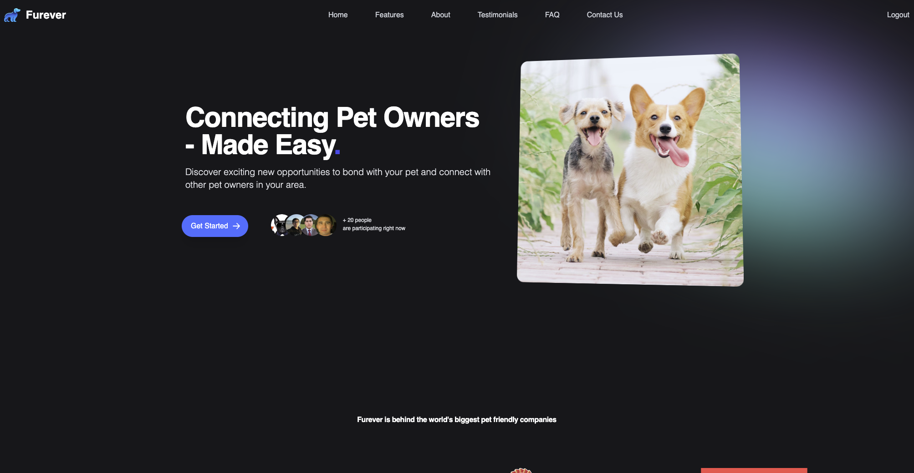
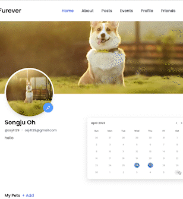
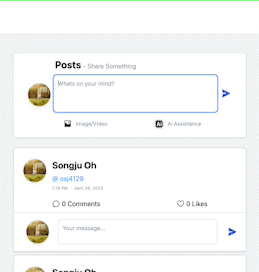

&nbsp;

&nbsp;

<!-- PROJECT LOGO -->
 

  
<h1 align="center">Furever</h1>

  

    
    
    Connect with fellow pet-owners and share your furry friend's 
  adventures on our social media platform!
     
    <a href="https://github.com/so-ss-rc-lc-capstone/project-pet/blob/main/README.md"><strong>Explore the docs »</strong></a>
     
     
    <a href="https://furever.space">Visit Website</a>
    
  

  
  

<!-- TABLE OF CONTENTS -->

  
Table of Contents

  <ol>
    <li>
      <a href="#about-the-project">About The Project</a>
      <ul>
        <li><a href="#built-with">Built With</a></li>
      </ul>
    </li>
    <li>
      <a href="#getting-started">Feature</a>
      <ul>
        <li><a href="#prerequisites">Prerequisites</a></li>
        <li><a href="#installation">Installation</a></li>
      </ul>
    </li>
    <li><a href="#contributing">Contributing</a></li>

  </ol>

<!-- ABOUT THE PROJECT -->
## About The Project

Furever.Space is a website dedicated to pet lovers and owners all over the world. Our goal is to create a community where pet owners can connect, share their experiences, and learn from each other.
&nbsp;

<h1 align="center">Features</h1>

## User Profiles
* You can create a profile for your pet and share their pictures, stories, and information. We use the Filestack API in order for users to upload their photos and customize their profile page to their liking. You can also browse through other users to find new friends for your furry companion. 
&nbsp;

## AI Assistance
* Our AI assistance feature uses the ChatGPT API in order to auto generate posts and event descriptions, allowing users to focus on putting out content. 
&nbsp;

## Feed
* Our feed is a great way to stay up-to-date with the latest news and events in the pet world. You can also share your own stories and pictures with other users as well as like and comment on other posts.
&nbsp;

## Events
* Using the mapbox API, we are able to display a users location and allow them to organize and search for events such as meetups, adoption drives, and pet fairs within their local proximity or even worldwide. These events are a great opportunity to meet other pet owners and their pets, learn new things, and have fun.
&nbsp;

## Chatting
* Connect with other pet owners and their pets with our built in messaging and chat features using the TalkJS API.
&nbsp;

We hope that you find our website useful and enjoyable. If you have any questions or feedback, please don't hesitate to contact us. Thank you for visiting Welcome to [Furever](https://furever.space)!

&nbsp;

&nbsp;

## Built With

Here are Languages

![JQuery][Java]
[![React][React.js]][React-url]
![js]
[![JQuery][JQuery.com]][JQuery-url]
![Mysql]
[![Tailwind]][Next-url]

&nbsp;

&nbsp;

## Contributors

<!-- MARKDOWN LINKS & IMAGES -->
<!-- https://www.markdownguide.org/basic-syntax/#reference-style-links -->
[contributors-shield]: https://img.shields.io/github/contributors/othneildrew/Best-README-Template.svg?style=for-the-badge
[contributors-url]: https://github.com/so-ss-rc-lc-capstone/project-pet/graphs/contributors
[forks-shield]: https://img.shields.io/github/forks/othneildrew/Best-README-Template.svg?style=for-the-badge
[forks-url]: https://github.com/othneildrew/Best-README-Template/network/members
[stars-shield]: https://img.shields.io/github/stars/othneildrew/Best-README-Template.svg?style=for-the-badge
[stars-url]: https://github.com/othneildrew/Best-README-Template/stargazers
[issues-shield]: https://img.shields.io/github/issues/othneildrew/Best-README-Template.svg?style=for-the-badge
[issues-url]: https://github.com/othneildrew/Best-README-Template/issues
[license-shield]: https://img.shields.io/github/license/othneildrew/Best-README-Template.svg?style=for-the-badge
[license-url]: https://github.com/othneildrew/Best-README-Template/blob/master/LICENSE.txt
[linkedin-shield]: https://img.shields.io/badge/-LinkedIn-black.svg?style=for-the-badge&logo=linkedin&colorB=555
[linkedin-url]: https://linkedin.com/in/othneildrew
[product-screenshot]: src/main/resources/static/img/home_page.png
[Next.js]: https://img.shields.io/badge/JavaScript-F7DF1E?style=for-the-badge&logo=javascript&logoColor=black
[Next-url]: https://nextjs.org/
[React.js]: https://img.shields.io/badge/HTML5-E34F26?style=for-the-badge&logo=html5&logoColor=white
[React-url]: https://reactjs.org/
[Java]: https://img.shields.io/badge/Java-ED8B00?style=for-the-badge&logo=java&logoColor=white
[Laravel-url]: https://laravel.com
[Bootstrap.com]: https://img.shields.io/badge/Bootstrap-563D7C?style=for-the-badge&logo=bootstrap&logoColor=white
[Bootstrap-url]: https://getbootstrap.com
[JQuery.com]: https://img.shields.io/badge/jQuery-0769AD?style=for-the-badge&logo=jquery&logoColor=white
[JQuery-url]: https://jquery.com
[Mysql]:https://img.shields.io/badge/MySQL-005C84?style=for-the-badge&logo=mysql&logoColor=white
[Tailwind]:https://img.shields.io/badge/Tailwind_CSS-38B2AC?style=for-the-badge&logo=tailwind-css&logoColor=white
[js]:https://img.shields.io/badge/JavaScript-323330?style=for-the-badge&logo=javascript&logoColor=F7DF1E

Meet our teams members!  
Our LinkedIn Profiles:
[Randy](https://www.linkedin.com/in/randy-chu-ab624566/),
[Said](https://www.linkedin.com/in/said-shah-66a7b2163/),
[Songju](https://www.linkedin.com/in/songju-oh/),
[Luke](https://www.linkedin.com/in/lukecal10/)

<a href="https://www.linkedin.com/in/lukecal10/">

</a>

 
